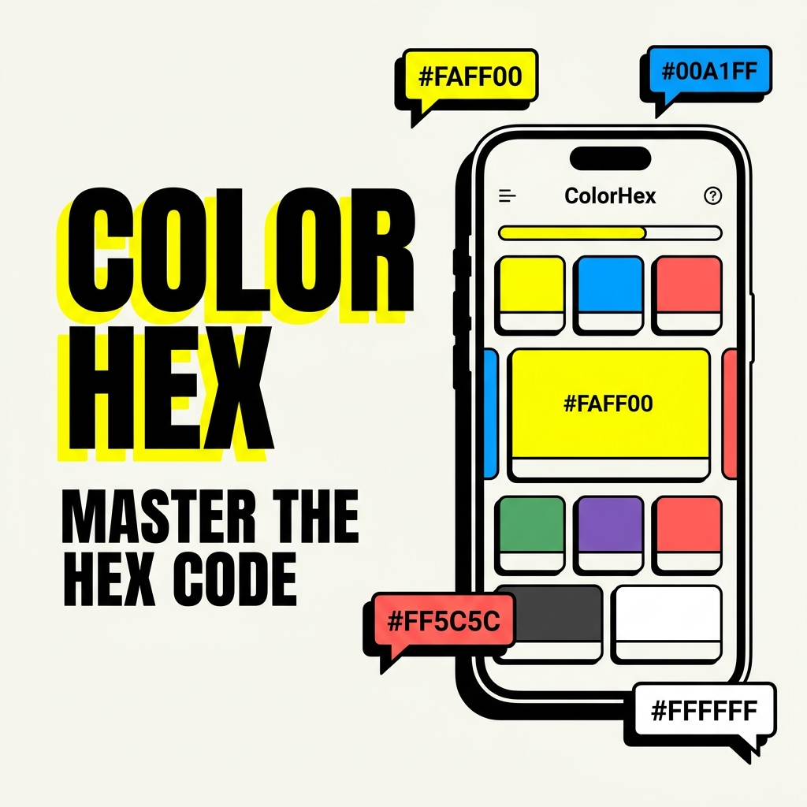
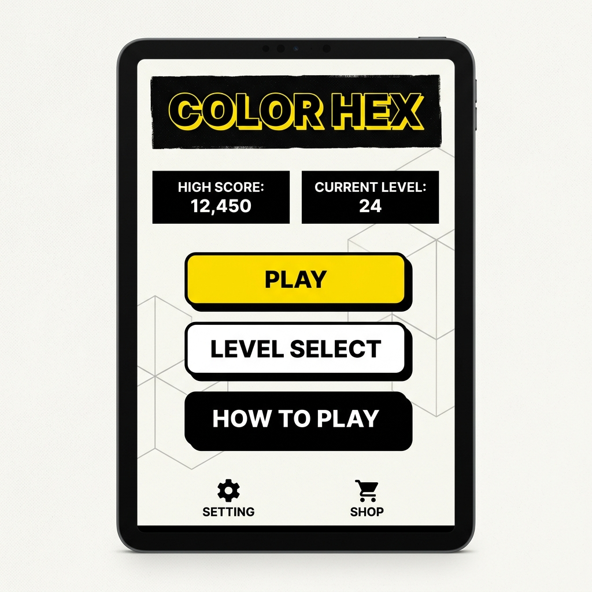
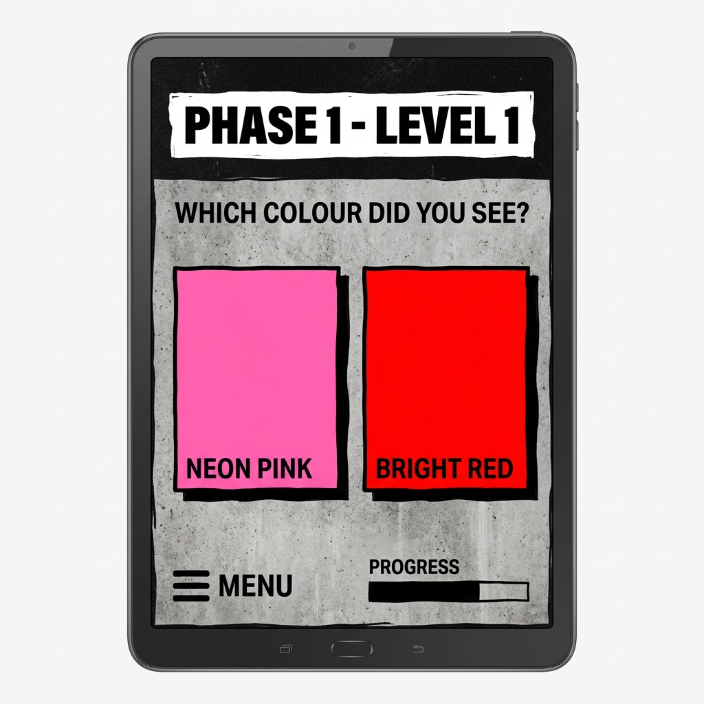
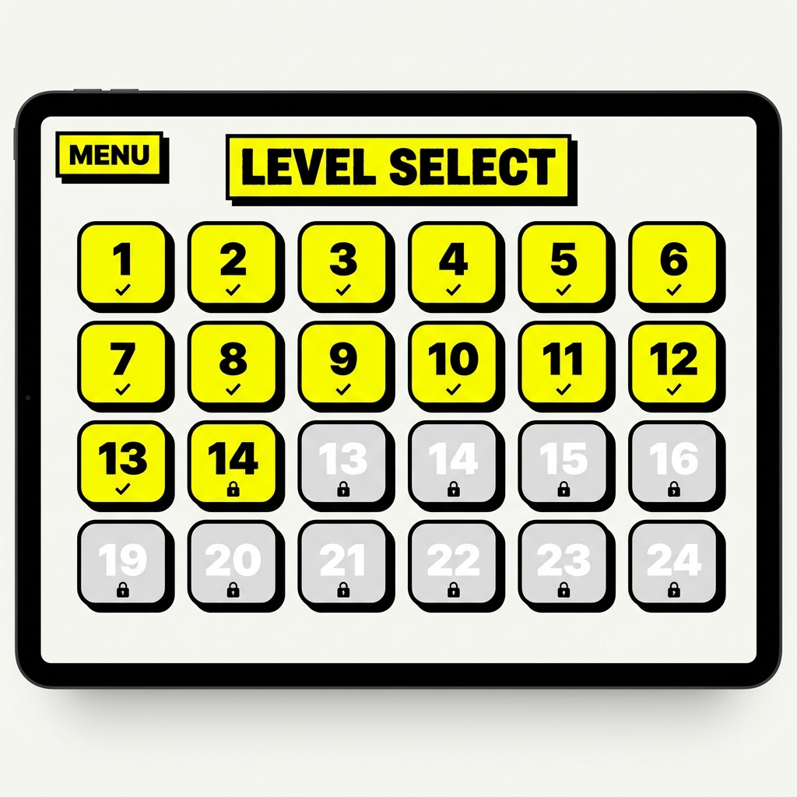
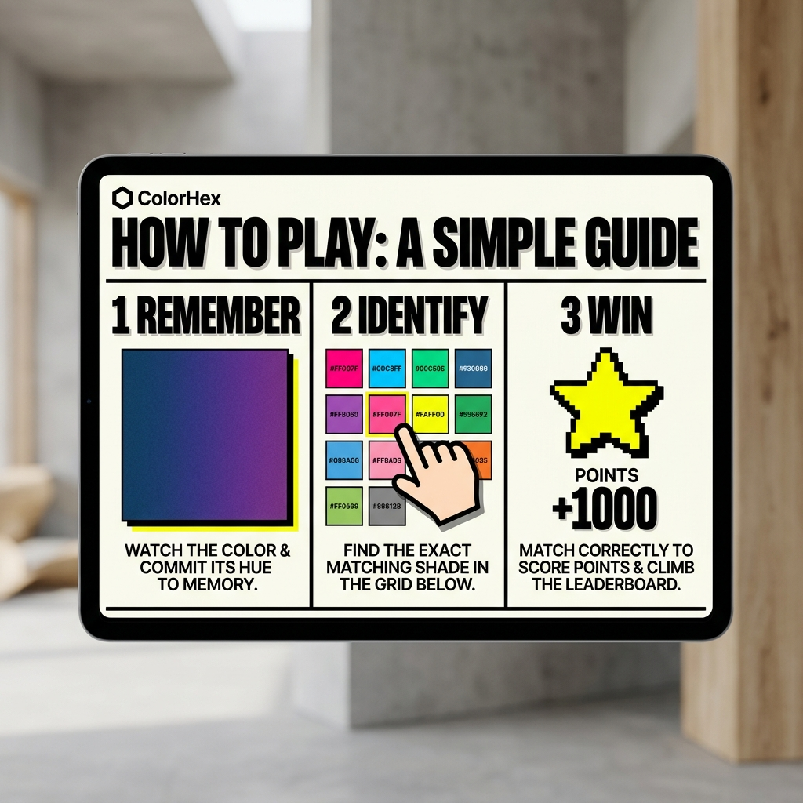

# ⬤ ColorHex — Master the Spectrum


> **"Can you match the perfect colour?"**
> ColorHex is a fast-paced, premium color matching game designed to test your precision and speed. Perfect for designers, artists, and spectrum enthusiasts.

---

## ◈ Features

| Feature | Description |
| :--- | :--- |
| **01. Study** | Memorize the target shade and its subtle details in a few seconds. |
| **02. Match** | Find the exact match among multiple variations in a high-pressure grid. |
| **03. Level Up** | 32 increasingly complex levels per phase with narrowing color differences. |
| **04. Multiple Phases** | Master single colors, duo blends, and the ultimate trio masteries. |
| **05. Premium Design** | A stunning Neo-Brutalist interface with smooth animations and vibrant feedback. |

---

## ◈ Tech Stack


- **Frontend**: Vanilla JS, HTML5, CSS3 (Neo-Brutalist Design)
- **Framework**: [Capacitor](https://capacitorjs.com/) for Cross-Platform Desktop/Mobile
- **Analytics**: Google Analytics 4 (Production-only)
- **Styling**: RetroUI/Neo-Brutalist Design System

---

## ◈ Installation

### Prerequisites
- Node.js (v16+)
- NPM

### Step-by-Step
1. **Clone the repository**
   ```bash
   git clone https://github.com/your-username/ColorHex.git
   cd ColorHex
   ```

2. **Install dependencies**
   ```bash
   npm install
   ```

3. **Run in local environment**
   ```bash
   # Open index.html in your favorite browser or use a live server
   npx serve .
   ```

4. **Build for Android (Capacitor)**
   ```bash
   npx cap sync
   npx cap open android
   ```

---

## ◈ Screenshots

<p align="center">
  
  
</p>
<p align="center">
  
  
</p>

---

## ◈ Contribution

We love contributions! Please read our [CONTRIBUTING.md](./CONTRIBUTING.md) to get started.

1. **Fork** the repository
2. **Create** your feature branch (`git checkout -b feature/AmazingFeature`)
3. **Commit** your changes (`git commit -m 'Add some AmazingFeature'`)
4. **Push** to the branch (`git push origin feature/AmazingFeature`)
5. **Open** a Pull Request

---

## ◈ Community & Conduct

We are committed to a welcoming environment. Please review our [Code of Conduct](./CODE_OF_CONDUCT.md).

---

## ◈ License

Distributed under the **MIT License**. See `LICENSE` for more information.

---

<p align="center">
  Built with ❤️ by the ColorHex Team.
</p>
